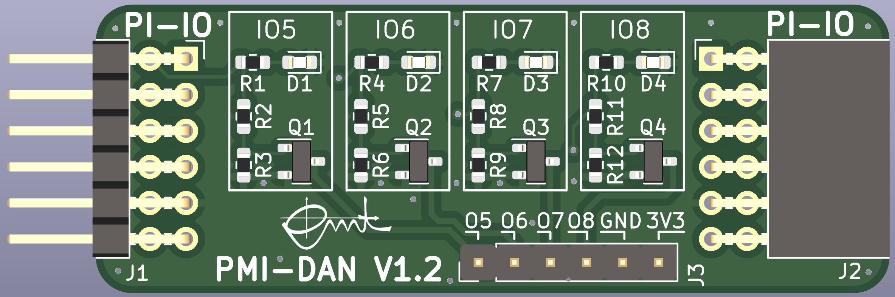

# PMI-DAN (Diodes And NMOS)

This pcb is designed for the course PMI (Practical course Microcontroller and Interface electronics). It features four LEDs and four open-drain NMOSFETs. It can be chained with [PMI-CARLOS](https://github.com/emtpb/pmi-hw-carlos) (thus only four of the available eight GPIO pins are used).

Pin header and sockets are compatible with
[Digilents Pmod](https://digilent.com/reference/pmod/start) interface.

The board can be used with [PMI-BOB2](https://github.com/emtpb/pmi-hw-bob2)
pcb.

An interactive html BOM file with pcb layout and material placement can be
found [here](bom/ibom.html).

# Changelog

## V1.0
* First prototype.

## V1.1
* First release.

